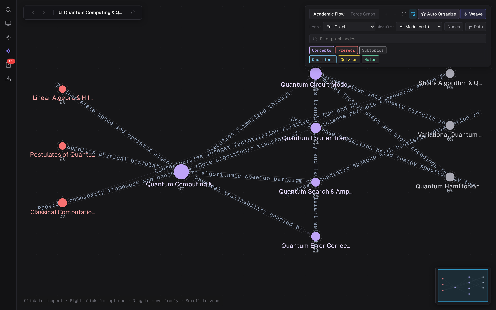
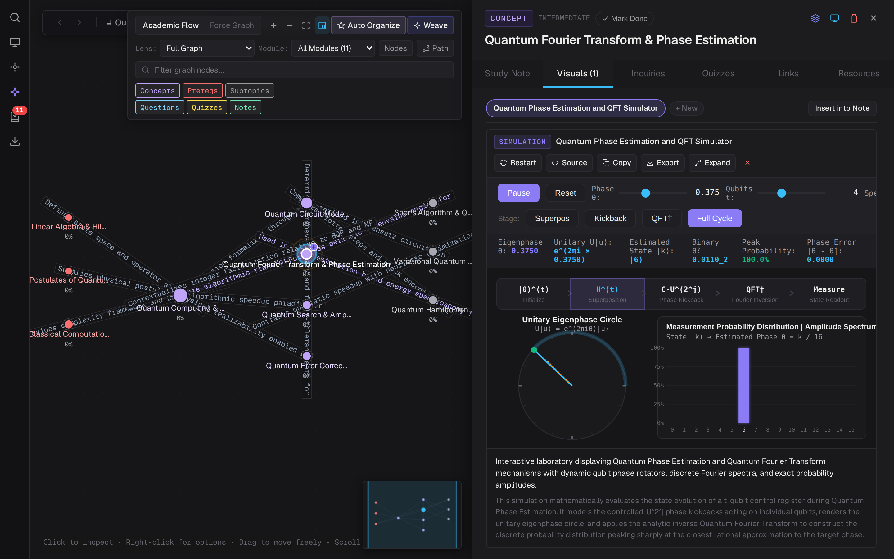
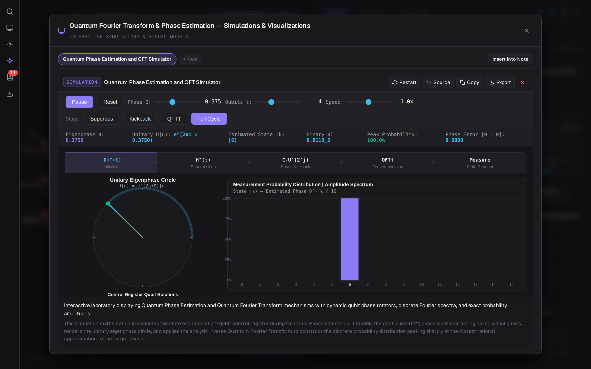
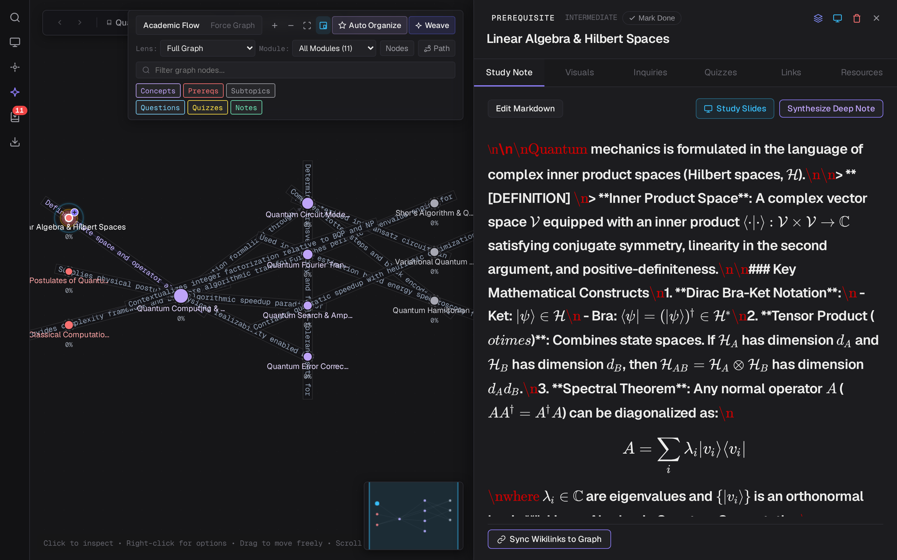
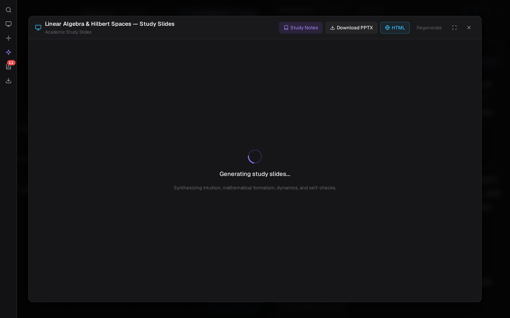

# Brain.md

> Minimalist knowledge graph engine for conceptual synthesis, interactive HTML5 simulations, Socratic inquiry, LaTeX-rendered study notes, and active recall.

[](https://www.typescriptlang.org/)
[](https://react.dev/)
[](https://fastapi.tiangolo.com/)
[](https://sqlite.org/)
[](https://ai.google.dev/)
[](LICENSE)

---



---

## Key Features

### 1. Interactive HTML5 Simulations & Parameter Labs
- **60 FPS Physics & Mathematical Models**: Dynamic HTML5 Canvas 2D and SVG simulations with silky-smooth animation loops, moving particles, vector fields, and wave mechanics.
- **Embedded Sandbox Execution**: Secure `iframe` sandboxing (`allow-scripts`) allows real-time execution without risking parent window integrity.
- **Obsidian Theme Design Tokens**: Embedded simulations inherit the obsidian dark palette (`--bg-primary: #161618`, `--bg-card: #222226`, `--accent: #8b7bf5`), typography, and borders.
- **Dynamic Parameter Sliders**: Real-time interactive controls (Speed, Frequency, Coupling, Phase) with instant metric readouts.
- **Embedded in Study Notes**: Simulation code inserted into notes automatically renders as an executable, interactive simulation card.
- **Full-Height Expanded View**: One-click expansion into a 92vh fullscreen modal with live code editor, restart, copy, and standalone `.html` download.





---

### 2. Obsidian-Grade Study Notes & KaTeX Math
- **Full LaTeX Typesetting**: In-line math (`$E=mc^2$`) and block equations (`$$\int_{-\infty}^\infty e^{-x^2} dx = \sqrt{\pi}$$`) powered by KaTeX.
- **Bidirectional `[[Wikilinks]]`**: Interactive internal linking across concepts with autocomplete, jump-to-section (`#`), and jump-to-block (`^`).
- **Academic Callouts**: GitHub & Obsidian alert blocks (`> [!NOTE]`, `> [!THEOREM]`, `> [!TIP]`, `> [!WARNING]`).
- **Socratic Inquiry Synthesis**: AI-assisted conceptual decomposition, follow-up inquiry synthesis, and prerequisite tracing.



---

### 3. Academic Study Slide Decks
- **Automatic Slide Deck Synthesis**: Synthesizes high-density lecture slide decks structured into Overview, Core Mechanisms, Mathematical Formulations, and Boundary Cases.
- **Presentation Modal**: Full-screen slide viewer with keyboard shortcuts (Arrow keys, Space, Esc), thumbnail drawer, and progress tracking.
- **Native Slide Exports**: Export study slide decks directly to Microsoft PowerPoint (`.pptx`) and standalone responsive HTML presentations.



---

### 4. Dynamic Knowledge Canvas & Concept Weaving
- **Hybrid Layout Engine**: Force-directed physics and hierarchical DAG layouts with rightward semantic spread.
- **Ontological Concept Weaving**: Dock new inquiries seamlessly into the knowledge graph; detects conceptual gaps and automatically generates stepping-stone bridge nodes.
- **Community Detection**: Graph clustering highlighting semantic concept clusters with distinct chromatic hues.
- **Shortest Path & Unlinked Mentions**: Graph algorithms discovering hidden connections across topics.

---

### 5. Active Recall & Spaced Repetition
- **SM-2 Spaced Repetition**: Leitner-style urgency queue calculating optimal review intervals based on difficulty and recall performance.
- **Conceptual Quizzes**: Multiple-choice diagnostic questions targeting conceptual traps and common misconceptions with rigorous academic explanations.
- **Question Promotion**: Elevate challenging quiz questions directly to first-class graph inquiry nodes.

---

## Tech Stack

| Layer | Technologies |
|---|---|
| **Frontend** | React 19, TypeScript, HTML5 Canvas 2D Engine, KaTeX, Marked, Mermaid.js, Vite |
| **Backend** | FastAPI, SQLite (PRAGMA WAL, JSON1, Foreign Keys), Pydantic v2, Python-PPTX |
| **AI Engine** | Google Gemini (`gemini-3.8-flash` with automatic fallback to `3.7-flash`, `3.5-flash`, and `2.5-flash`) |
| **Styling** | Obsidian Dark Theme CSS Variables, Geist Mono, Minimalist Swiss Typography |
| **Package Manager** | pnpm |

---

## Quickstart

### Prerequisites

- Python 3.10+
- Node.js 18+ & pnpm
- Google Cloud Application Default Credentials (`gcloud auth application-default login`) or `GEMINI_API_KEY`

### Unified Launch

Start both backend (:8000) and frontend (:5173) with a single command:

```bash
./start.sh
```

Or run services independently:

```bash
# Backend (FastAPI on :8000)
pip install -r backend/requirements.txt
python3 -m uvicorn backend.app.main:app --host 127.0.0.1 --port 8000 --reload

# Frontend (Vite on :5173)
cd frontend
pnpm install
pnpm dev
```

---

## Testing

Run the comprehensive test suite (API, spaced repetition, graph bridging, slides export, interactive simulations):

```bash
# Backend tests
pytest backend/tests -v

# Frontend build verification
cd frontend && pnpm run build
```

---

## License

[MIT](LICENSE)

